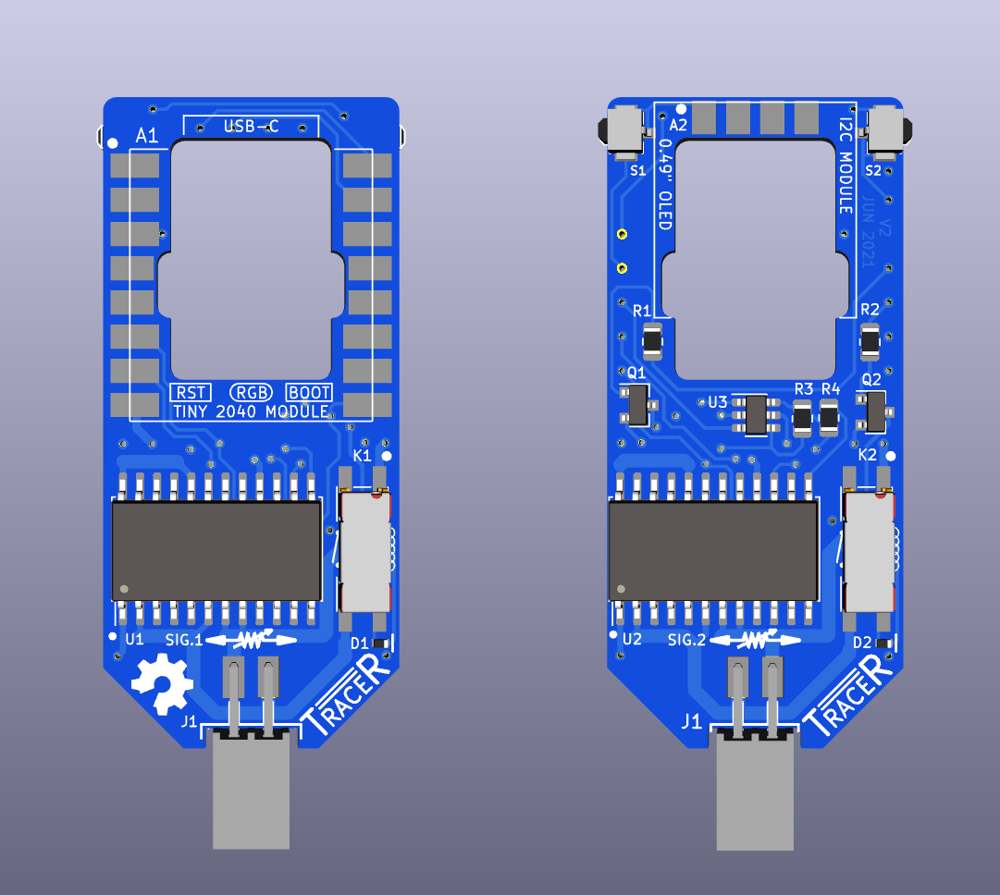

# TraceR -- Module for Simulating Conductive Ink PCB Traces

# Revisions

### Version 2

* Digipot power supply from from 3.3 to 5, in order to reduce the wiper
  resistance further (see the datasheet). This means the addition of
  level translator for the MISO signal into the MCU. 

* The digipot SDO pin is open drain. Added pullup resistors on each one.

* Assembly of modules onto v1 board was difficult. And the whole assembly 
  needs to be thinner so two modules can be installed adjacent to each
  other (relates to the pin header spacing on the main board). Gave up
  on the idea of avoiding a board cutout. Re-routing of signals, and
  made the board just slightly larger (mostly taller) to allow for the
  required cutout.

* Changed PCB thickness from 1.6 to 1.0 mm.

* Found some tiny buttons (about the same size as those on the Tiny 2040
  module) and put them at the top corners. This will allow the user to
  change resistance values without using the serial port.

### Version 1

First release. 

# Observations

Before I forget, here are some thoughts to consider if there ever is
going to be a version 3.

* Make D1/D2 larger, since that package is nearly impossible to hand
  solder. Or...

* Make the transistor and resistor packages smaller and reflow rather
  than hand solder. Also, Digipots are available in a smaller package:
    * TSSOP-24 package 7.8 x 4.4 mm 
    * SOIC-24W 15.4 x 7.5 mm (currently used)

* Look carefully at the Adafruit Qt Py RP2040 module. It looks smaller,
  has a smaller and well-defined required cutout and mechanical
  drawings. Fewer pins.

* Save even more space my tossing the module concept and building the
  RP2040 board and the OLED module directly on the TraceR's PCB.

